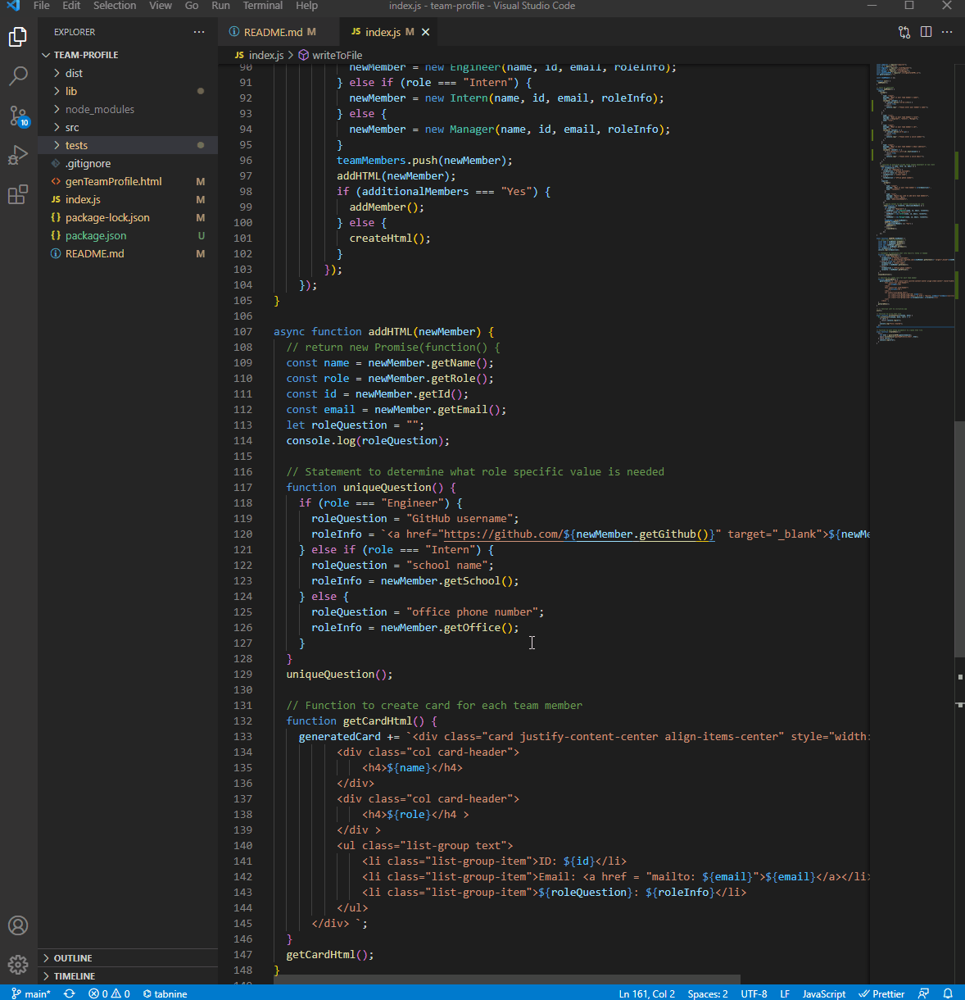
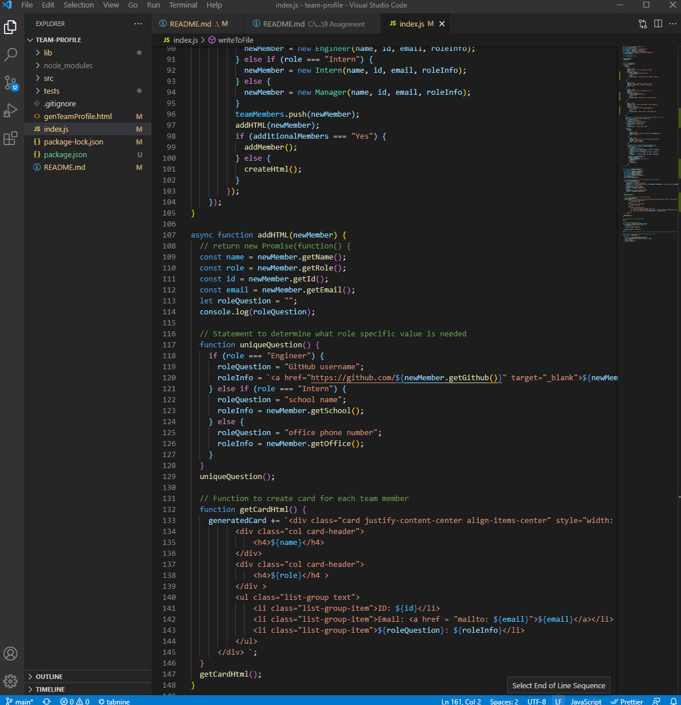

# Team Profile Generator
Team Profile Generator
[[Repository Link](https://github.com/ElusiveSkies/team-profile)]
[[Example of Generated Team Profile](https://elusiveskies.github.io/team-profile/genTeamProfile.html)]

## Table of Contents

- [Installation](#Installation)
- [Technology](#Technology)
- [Usage](#Usage)
- [License](#License)
- [Tests](#Tests)
- [Questions](#Questions)

## Description

An application that prompts for user input to create a team containing manager(s), engineer(s), and intern(s).
Using the input data an html file will be dynamically generated.

The values available include the following:

    1. Team member's name
    2. What role they perform
    3. What their id number is
    4. Contact Email
    5. Unique Questions (Is dependent on role)
      a. Manager - Office Phone Number 
      b. Engineer - Github username
      c. Intern - School attended

After the values have been entered, meeting the required validation parameters, a page will be displayed with the details of each team member. The email address(es) will open in the default email program. All github profiles will open a new tab for the user's profile.

## Technology

- HTML
- CSS
- Javascript
- Jest
- Inquirer

## Installation

From the integrated terminal the user will type:

  **npm i**

Followed by pressing enter.
This will result in the installation of *inquirer* and *jest*

## Usage

Entering the following in the integrated terminal to begin:
**node index.js**

Video of Usage

Video of Tests

## License

## Tests

Tests were added to ensure the classes/subclasses were displayed the expected functionality.
Performance of tests may be observed but running just
**npm test**

## Questions

[[Contact me](mailto:elusiveskies@gmail.com)]

[[Elusiveskies](https://www.github.com/Elusiveskies)]